---
hide:
  - navigation
---

# Non-Application Artworks

These are non-application artworks composed 2 years ago.

<figure markdown>
  { data-title="hill" data-description="blah blah blah..." }
  <figcaption>Hill (Oil Painting)</figcaption>
</figure>

<figure markdown>
  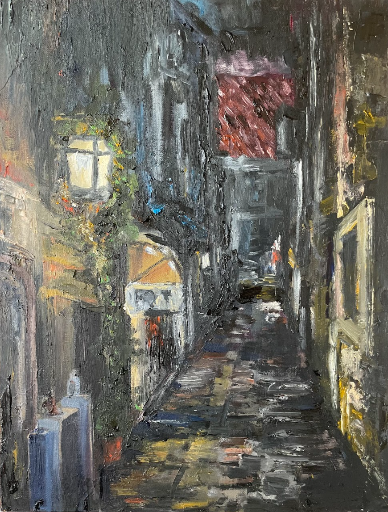{ data-title="italy" data-description="blah blah blah..." }
  <figcaption>Dark Alleyway (Oil painting)</figcaption>
</figure>

<figure markdown>
  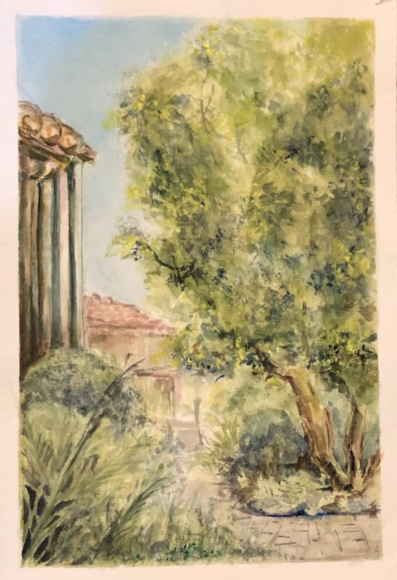{ data-title="my_house" data-description="blah blah blah..." }
  <figcaption>My Garden (Watercolor)</figcaption>
</figure>

<figure markdown>
  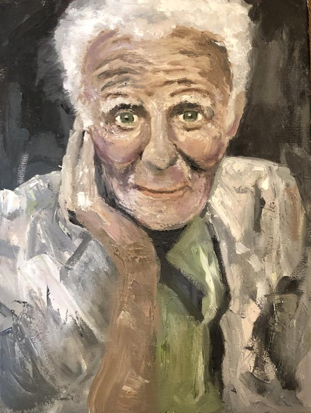{ data-title="elder" data-description="blah blah blah..." }
  <figcaption>Elderly (Oil Painting)</figcaption>
</figure>

These are my designs for the Val Cucine conventional oven. This is concept art for an italian color scheme with the theme of Italian food.

<figure markdown>
  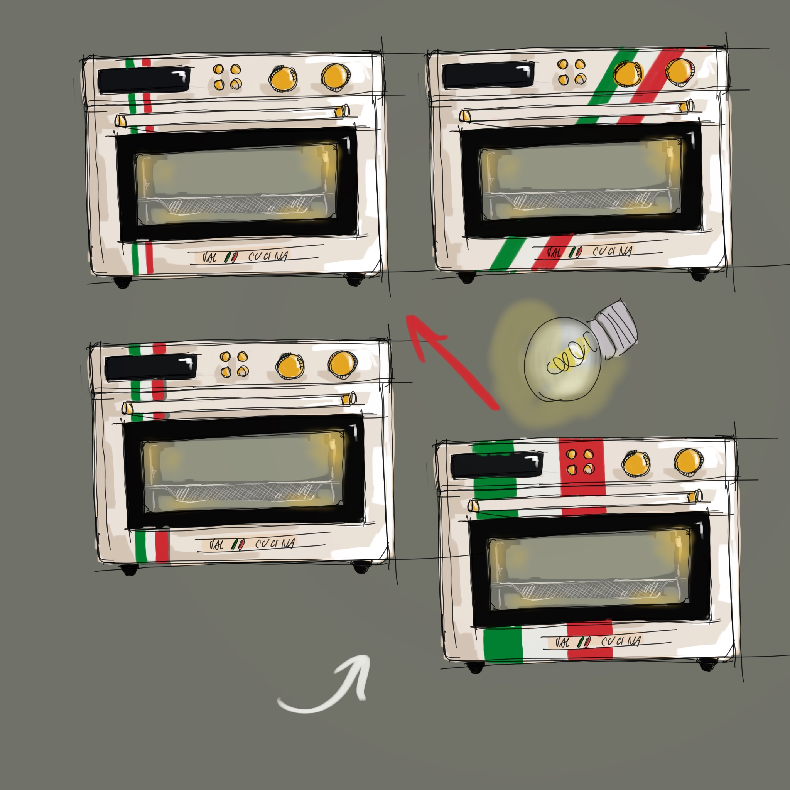{ data-title="design1" data-description="blah blah blah..." }
  <figcaption>Design 1</figcaption>
</figure>

<figure markdown>
  { data-title="design2" data-description="blah blah blah..." }
  <figcaption>Design 2</figcaption>
</figure>

<figure markdown>
  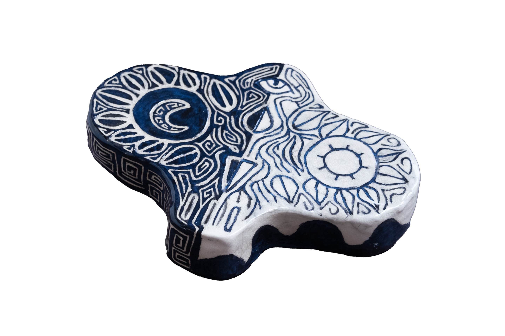{ data-title="2" data-description="blah blah blah..." }
  <figcaption>2</figcaption>
</figure><figure markdown>
This is a ceramic project made with an Aztec inspired pattern carved into it, creating an illustration representing the contrast between night and day.
<figure markdown>
  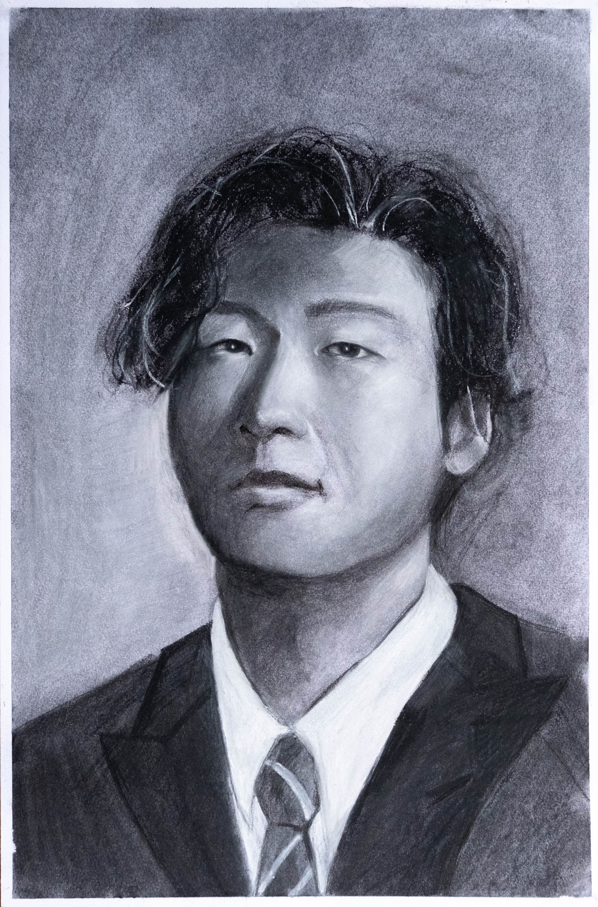{ data-title="3" data-description="blah blah blah..." }
  <figcaption>3</figcaption>
</figure><figure markdown>
A standard portrait created using black and white charcoal.
<figure markdown>
  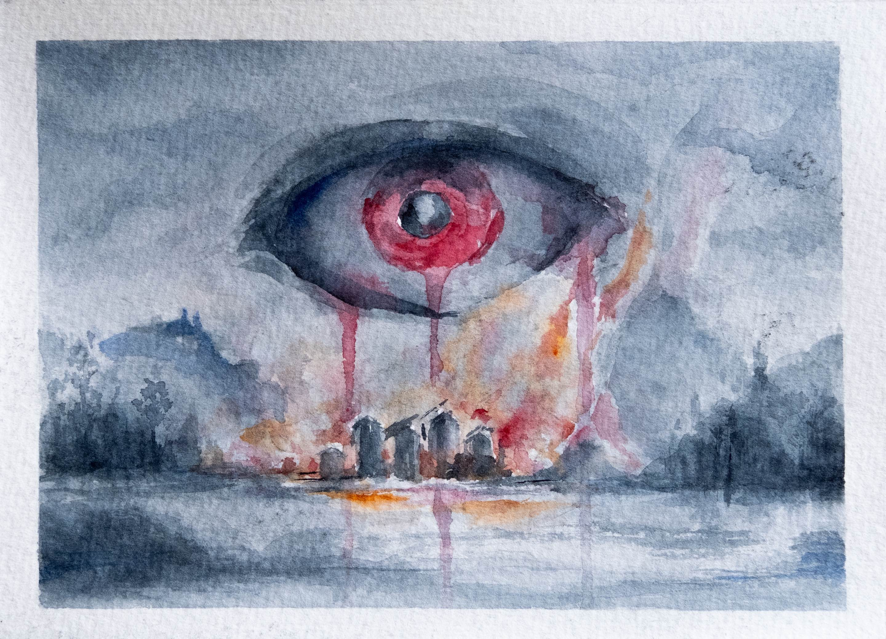{ data-title="4" data-description="blah blah blah..." }
  <figcaption>4</figcaption>
</figure><figure markdown>
Small watercolor painting that depicts a bloody eye above a cold landscape
<figure markdown>
  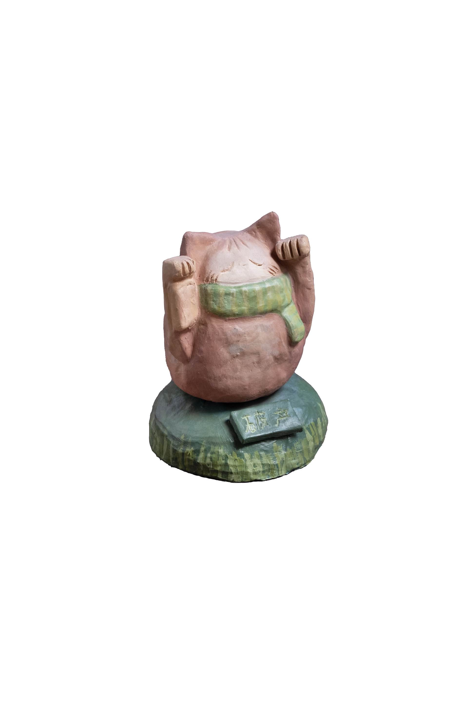{ data-title="5" data-description="blah blah blah..." }
  <figcaption>5</figcaption>
</figure><figure markdown>

<figure markdown>
  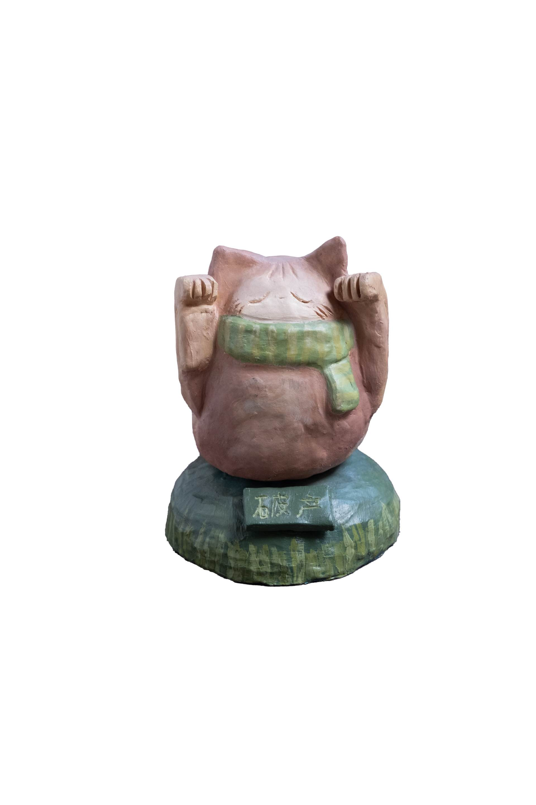{ data-title="6" data-description="blah blah blah..." }
  <figcaption>6</figcaption>
</figure><figure markdown>
Ceramic cat sculpture, painted with acrylic. This was made to contrast the "Lucky cat" statues often seen in asian restaurants. The sign on the base says, "bankruptcy" in contrast to it usually representing wealth and fortune.
<figure markdown>
  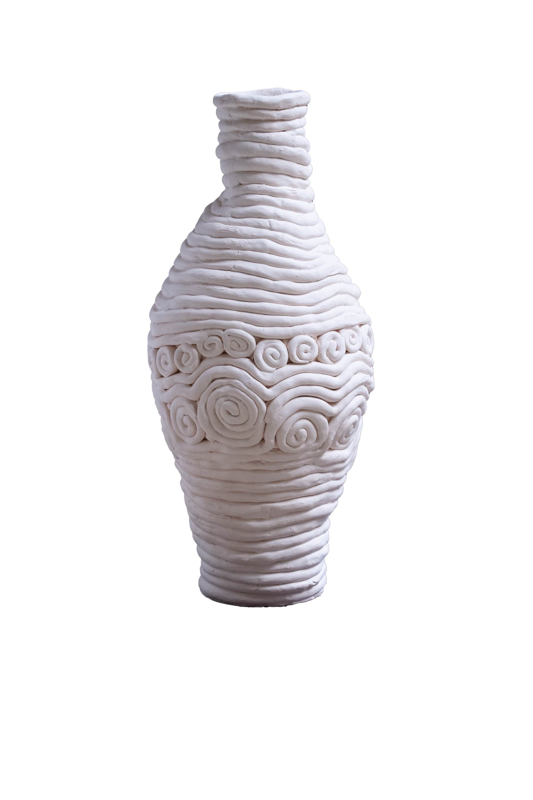{ data-title="7" data-description="blah blah blah..." }
  <figcaption>7</figcaption>
</figure><figure markdown>
Clay vase made using a layering technique, with occasional patterns embedded into it.
<figure markdown>
  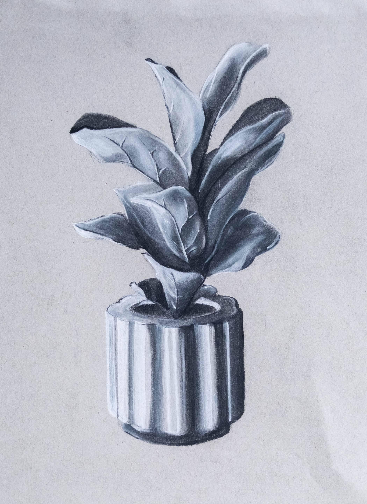{ data-title="8" data-description="blah blah blah..." }
  <figcaption>8</figcaption>
</figure><figure markdown>
A flower pot made with white and black charcoal, illustrating a high contrast in colors.
<figure markdown>

<figure markdown>
  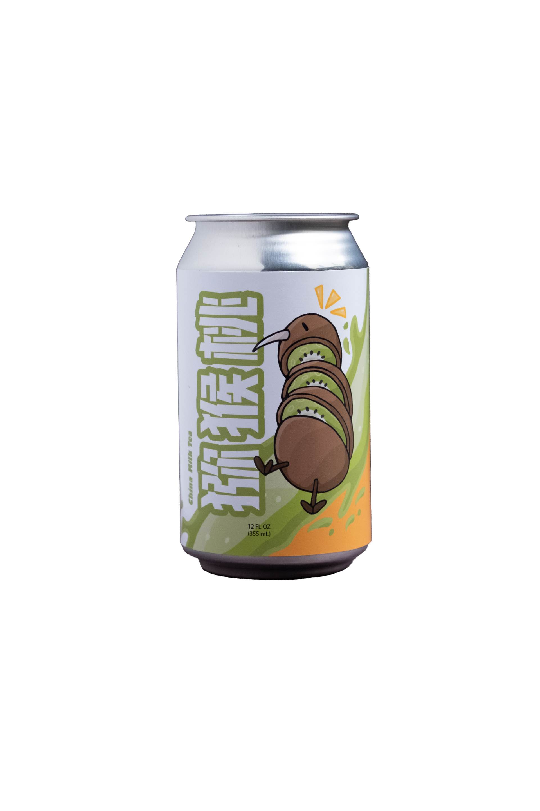{ data-title="10" data-description="blah blah blah..." }
  <figcaption>10</figcaption>
</figure><figure markdown>
A product design featureing a kiwi-flavoured milk tea, created in photoshop.
<figure markdown>
  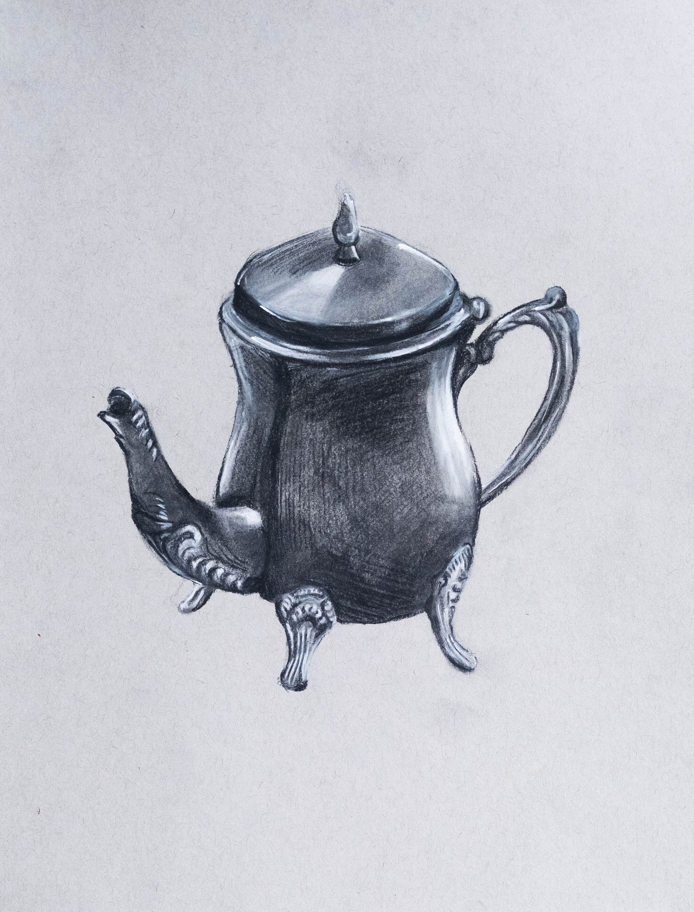{ data-title="11" data-description="blah blah blah..." }
  <figcaption>11</figcaption>
</figure><figure markdown>
A quick practice on drawing metalic objects using white and black charcoal.
