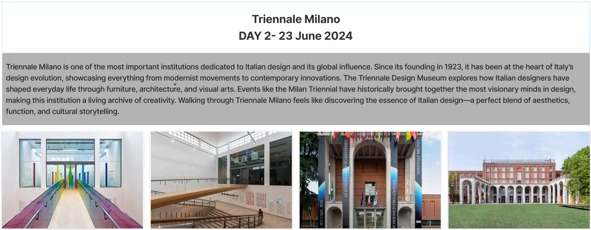
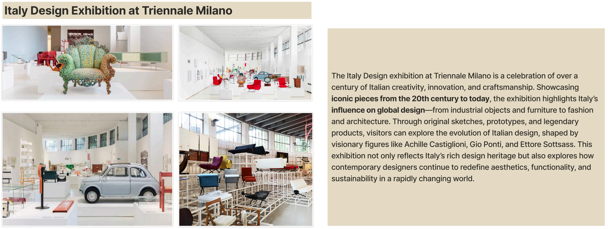
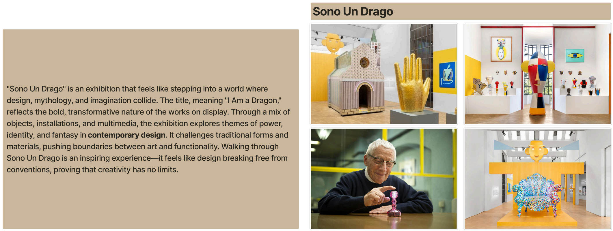
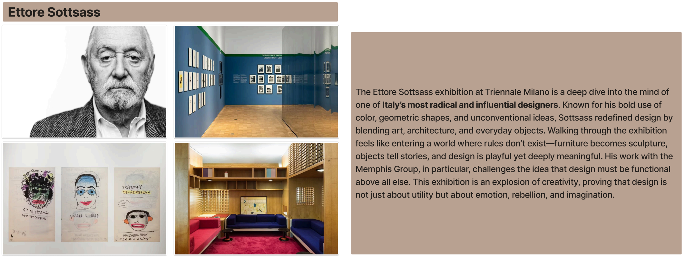
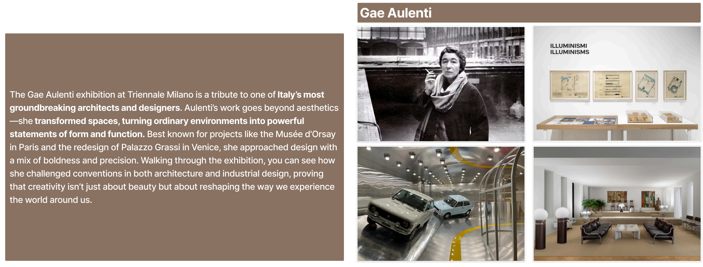
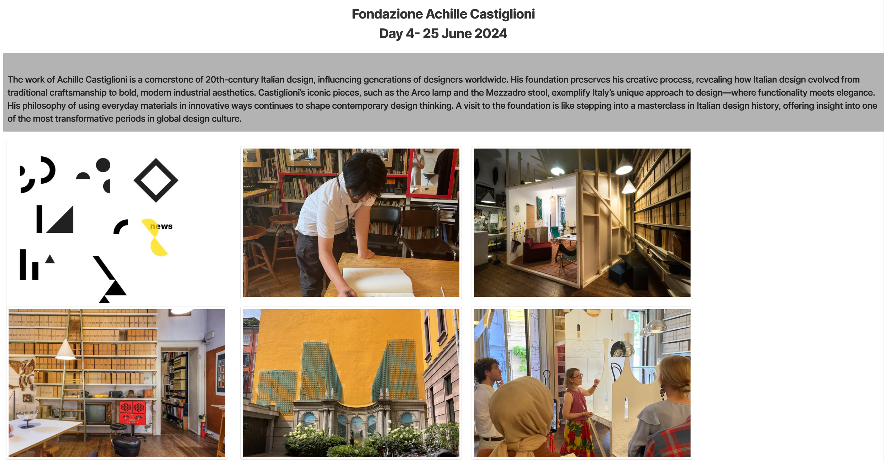
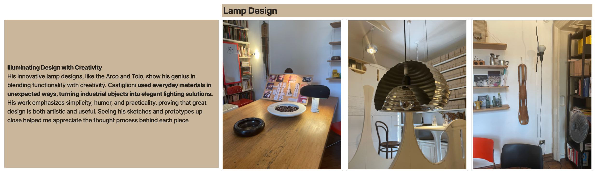
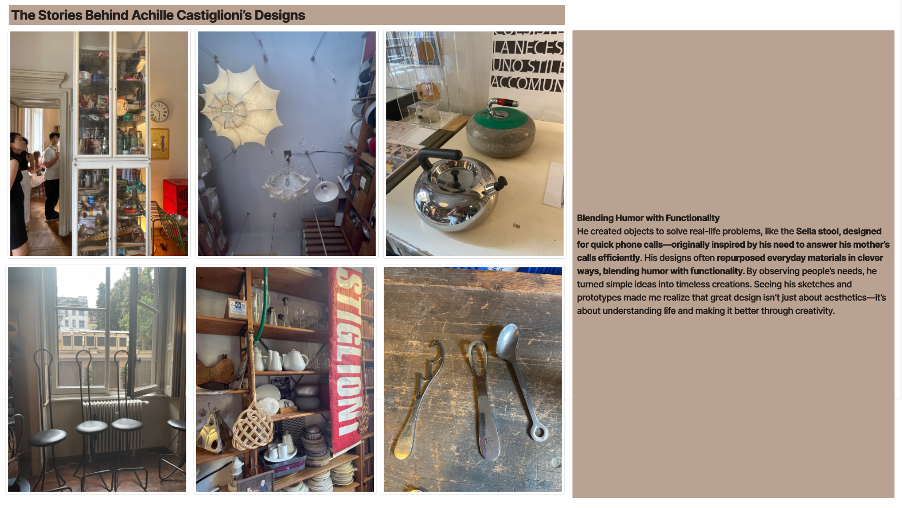

---
hide:
  - navigation
---

# Design studios visited during my time in Italy.

## Triennale Milano

<figure markdown>
  { data-title=" " data-description=" " }
  <figcaption> </figcaption>
</figure>

<figure markdown>
  { data-title=" " data-description=" " }
  <figcaption> </figcaption>
</figure>

<figure markdown>
  { data-title=" " data-description=" " }
  <figcaption> </figcaption>
</figure>

<figure markdown>
  { data-title=" " data-description=" " }
  <figcaption> </figcaption>
</figure>

<figure markdown>
  { data-title=" " data-description=" " }
  <figcaption> </figcaption>
</figure>

## Fondazione Achille Castiglioni

<figure markdown>
  { data-title=" " data-description=" " }
  <figcaption> </figcaption>
</figure>

<figure markdown>
  ![fac1]{fac1}.png){ data-title=" " data-description=" " }
  <figcaption> </figcaption>
</figure>

<figure markdown>
  { data-title=" " data-description=" " }
  <figcaption> </figcaption>
</figure>

<figure markdown>
  { data-title=" " data-description=" " }
  <figcaption> </figcaption>
</figure>

## 