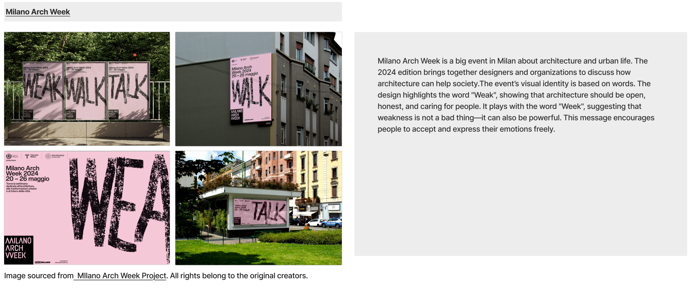
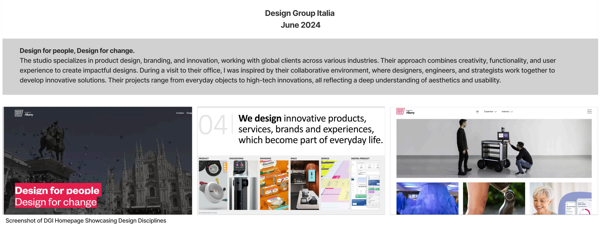

---
hide:
  - navigation
---

# Design studios visited during my time in Italy.

## Triennale Milano

<figure markdown>
  { data-title=" " data-description=" " }
  <figcaption> </figcaption>
</figure>

<figure markdown>
  { data-title=" " data-description=" " }
  <figcaption> </figcaption>
</figure>

<figure markdown>
  { data-title=" " data-description=" " }
  <figcaption> </figcaption>
</figure>

<figure markdown>
  { data-title=" " data-description=" " }
  <figcaption> </figcaption>
</figure>

<figure markdown>
  { data-title=" " data-description=" " }
  <figcaption> </figcaption>
</figure>

## Fondazione Achille Castiglioni

<figure markdown>
  { data-title=" " data-description=" " }
  <figcaption> </figcaption>
</figure>

<figure markdown>
  { data-title=" " data-description=" " }
  <figcaption> </figcaption>
</figure>

<figure markdown>
  { data-title=" " data-description=" " }
  <figcaption> </figcaption>
</figure>

<figure markdown>
  { data-title=" " data-description=" " }
  <figcaption> </figcaption>
</figure>

## Mario Trimarchi Design

</figure><figure markdown>
  { data-title=" " data-description=" " }
  <figcaption> </figcaption>
</figure>

</figure><figure markdown>
  { data-title=" " data-description=" " }
  <figcaption> </figcaption>
</figure>

</figure><figure markdown>
  { data-title=" " data-description=" " }
  <figcaption> </figcaption>
</figure>

</figure><figure markdown>
  { data-title=" " data-description=" " }
  <figcaption> </figcaption>
</figure>

## Parco Studio

</figure><figure markdown>
  { data-title=" " data-description=" " }
  <figcaption> </figcaption>

</figure></figure><figure markdown>
  { data-title=" " data-description=" " }
  <figcaption> </figcaption>

</figure></figure><figure markdown>
  { data-title=" " data-description=" " }
  <figcaption> </figcaption>

</figure></figure><figure markdown>
  { data-title=" " data-description=" " }
  <figcaption> </figcaption>
</figure>

## ATTO

</figure></figure><figure markdown>
  { data-title=" " data-description=" " }
  <figcaption> </figcaption>
</figure>

</figure></figure><figure markdown>
  { data-title=" " data-description=" " }
  <figcaption> </figcaption>
</figure>

</figure></figure><figure markdown>
  { data-title=" " data-description=" " }
  <figcaption> </figcaption>
</figure>

</figure></figure><figure markdown>
  { data-title=" " data-description=" " }
  <figcaption> </figcaption>
</figure>

## Frog

<figure markdown>
  { data-title=" " data-description=" " }
  <figcaption> </figcaption>

</figure><figure markdown>
  { data-title=" " data-description=" " }
  <figcaption> </figcaption>

</figure><figure markdown>
  { data-title=" " data-description=" " }
  <figcaption> </figcaption>

</figure><figure markdown>
  { data-title=" " data-description=" " }
  <figcaption> </figcaption>
</figure>

## Design Group Italia

</figure><figure markdown>
  { data-title=" " data-description=" " }
  <figcaption> </figcaption>

</figure></figure><figure markdown>
  { data-title=" " data-description=" " }
  <figcaption> </figcaption>
</figure>
