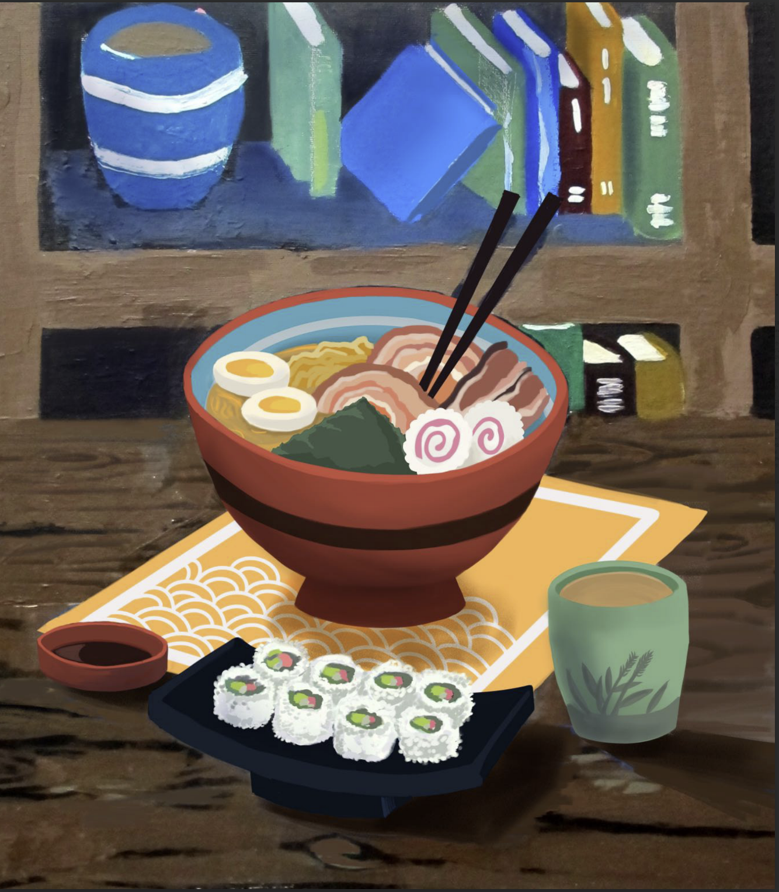

---
hide:
  - navigation
---

# OCSA Visual Arts

## Application artwork for Orange County School of the Arts(OCSA)

<figure markdown>
  { data-title="Hero Character (Digital)" data-description="blah blah blah..." }
  <figcaption>Alley (Digital)</figcaption>
</figure>

<figure markdown>
  { data-title="Ramen (Digital and Acrylic)" data-description="blah blah blah..." }
  <figcaption>Ramen(Digital and Acrylic)</figcaption>
</figure>

<figure markdown>
  { data-title="jacket, shoe, glasses, and water still life" data-description="the description" }
  <figcaption>jacket, shoe, glasses, and water (pencil)</figcaption>
</figure>