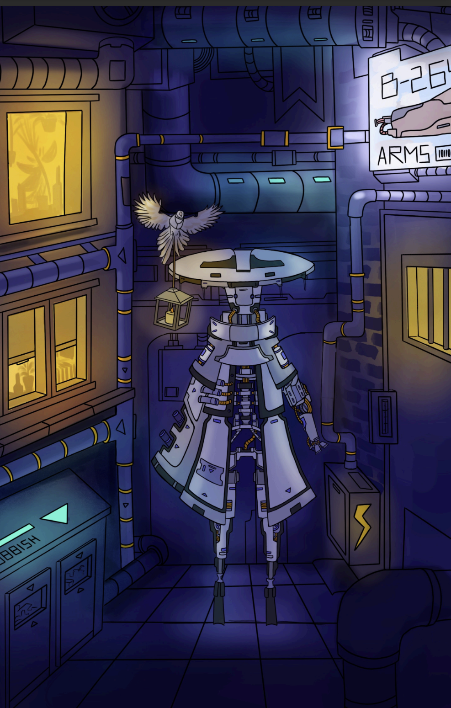
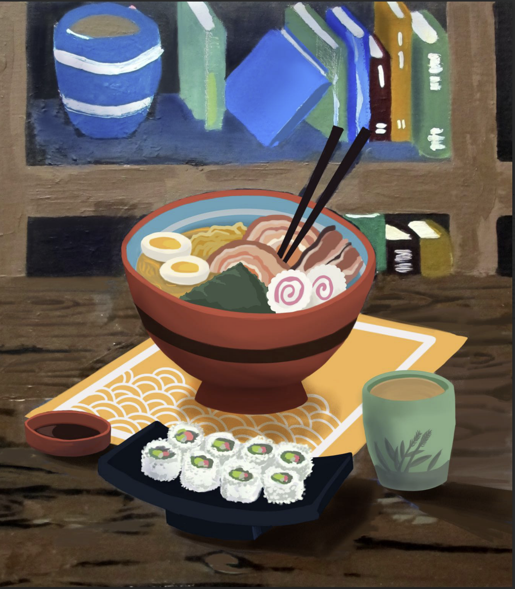
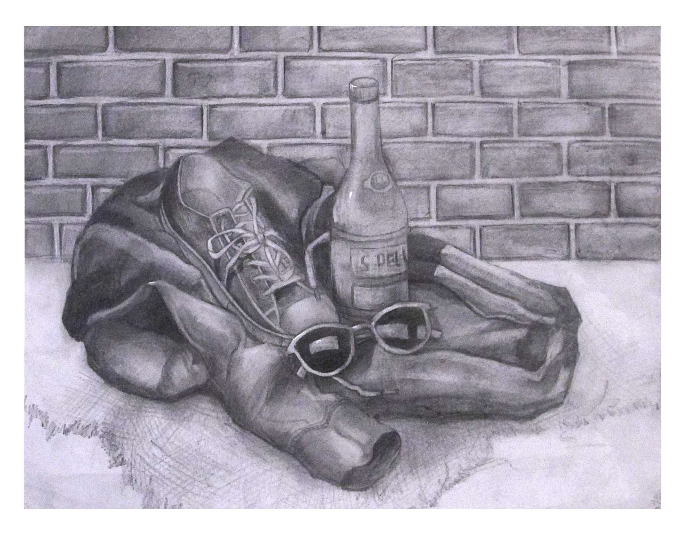
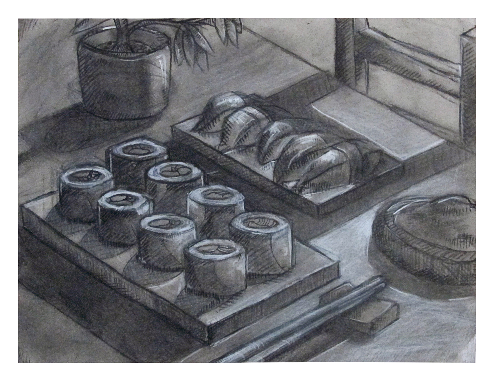
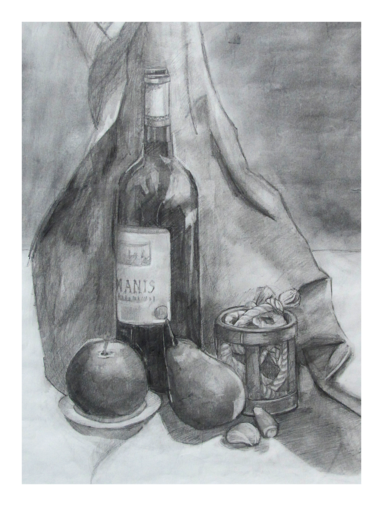
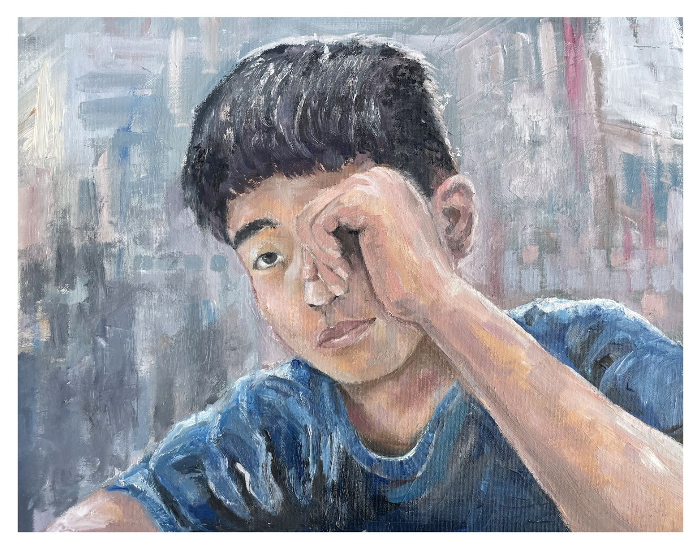
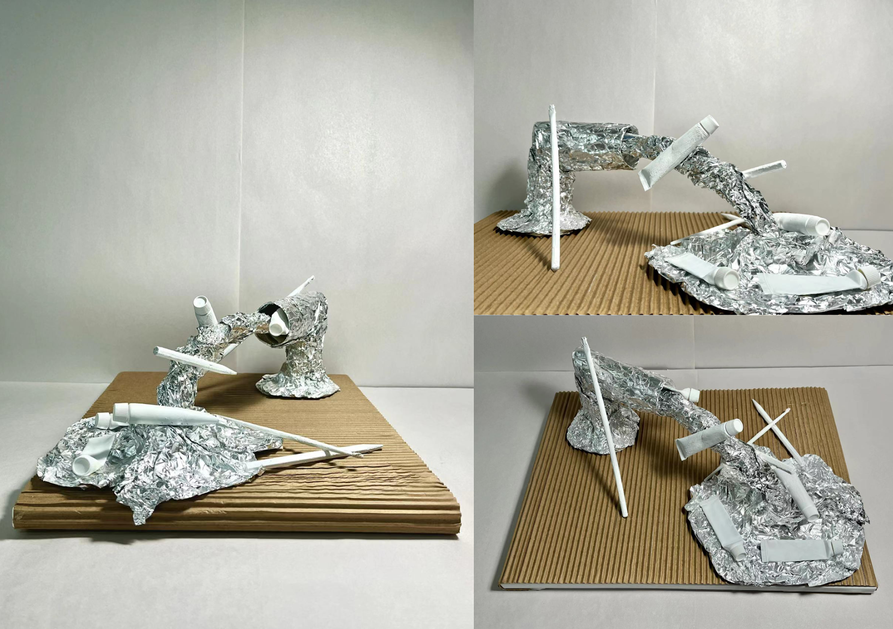
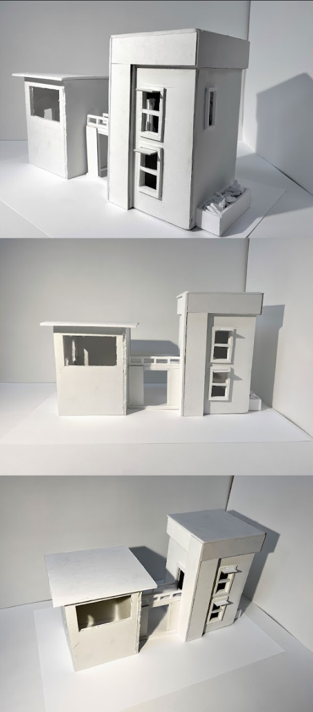
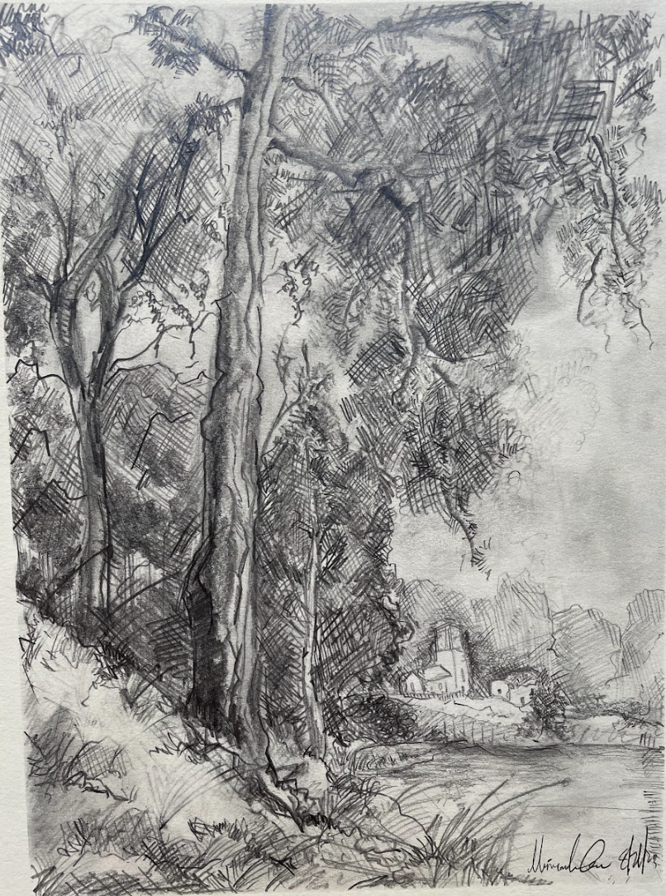
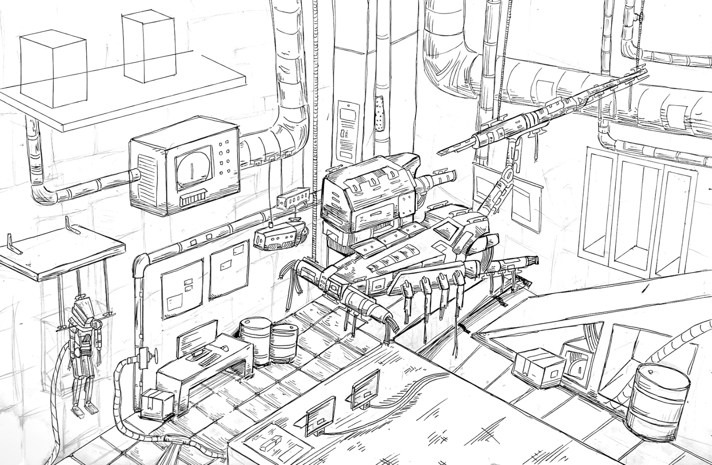

---
hide:
  - navigation
---

# Walnut Portfolio

## Application artwork for Walnut Hill School for the Arts

<figure markdown>
  { data-title="Hansel and Gretel (Acrylic)" data-description="blah blah blah..." }
  <figcaption>Hansel and Gretel (Acrylic)</figcaption>
</figure>

<figure markdown>
  { data-title="Pot, cups, rose, and fruit (Pencil and graphite powder)" data-description="blah blah blah..." }
  <figcaption>Pot, cups, rose, and fruit (Pencil and graphite powder)</figcaption>
</figure>

<figure markdown>
  { data-title="Hero Character (Digital)" data-description="blah blah blah..." }
  <figcaption>Alley (Digital)</figcaption>
</figure>

<figure markdown>
  { data-title="Ramen (Digital and Acrylic)" data-description="blah blah blah..." }
  <figcaption>Ramen(Digital and Acrylic)</figcaption>
</figure>

<figure markdown>
  { data-title="jacket, shoe, glasses, and water still life" data-description="the description" }
  <figcaption>jacket, shoe, glasses, and water (pencil)</figcaption>
</figure>

<figure markdown>
  { data-title="Sushi for Dinner (Black and white charcoal)" data-description="blah blah blah..." }
  <figcaption>Sushi for Dinner (Black and white charcoal)</figcaption>
</figure>

<figure markdown>
  { data-title="Wine, fruit, and rope (Pencil)" data-description="blah blah blah..." }
  <figcaption>Wine, fruit, and rope (Pencil)</figcaption>
</figure>

<figure markdown>
  { data-title="Self Portrait (Oil Painting)" data-description="blah blah blah..." }
  <figcaption>Self Portrait (Oil Painting)</figcaption>
</figure>

<figure markdown>
  { data-title="abstract" data-description="blah blah blah..." }
  <figcaption>Abstract (Mixed)</figcaption>
</figure>

<figure markdown>
  { data-title="house" data-description="blah blah blah..." }
  <figcaption>house (Foam and Glue)</figcaption>
</figure>

<figure markdown>
  { data-title="tree" data-description="blah blah blah..." }
  <figcaption>Tree and Village (pencil)</figcaption>
</figure>

<figure markdown>
  { data-title="robotics_lab" data-description="blah blah blah..." }
  <figcaption>Robotics Lab (Pen)</figcaption>
</figure>

<figure markdown>
  { data-title="hand" data-description="blah blah blah..." }
  <figcaption>Hand (Pencil)</figcaption>
</figure>